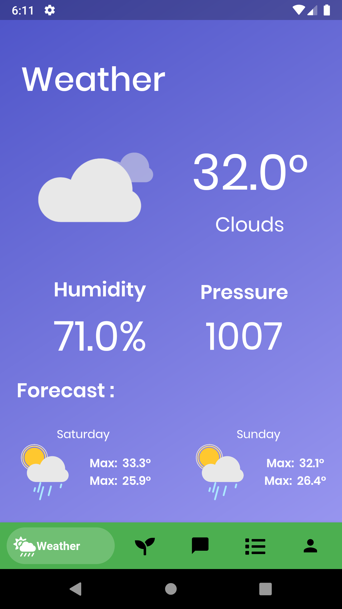
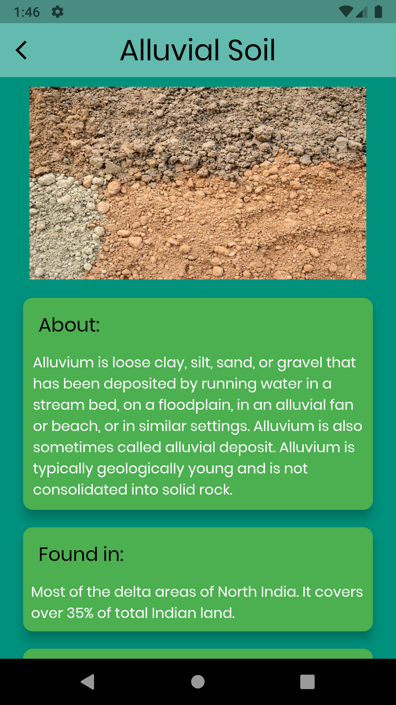
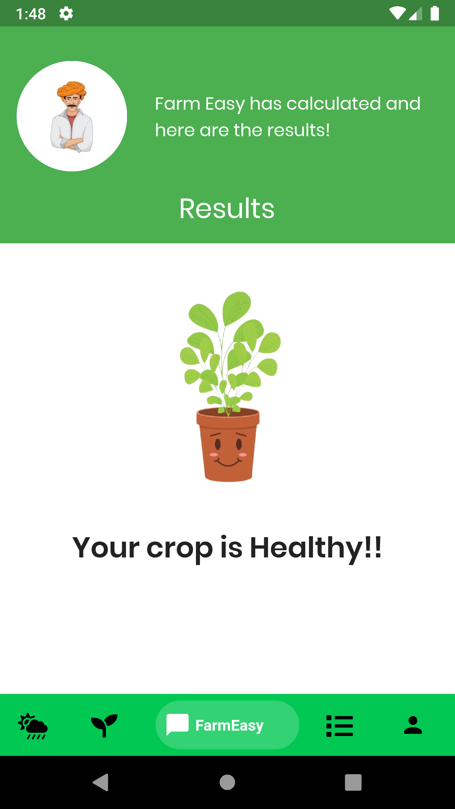
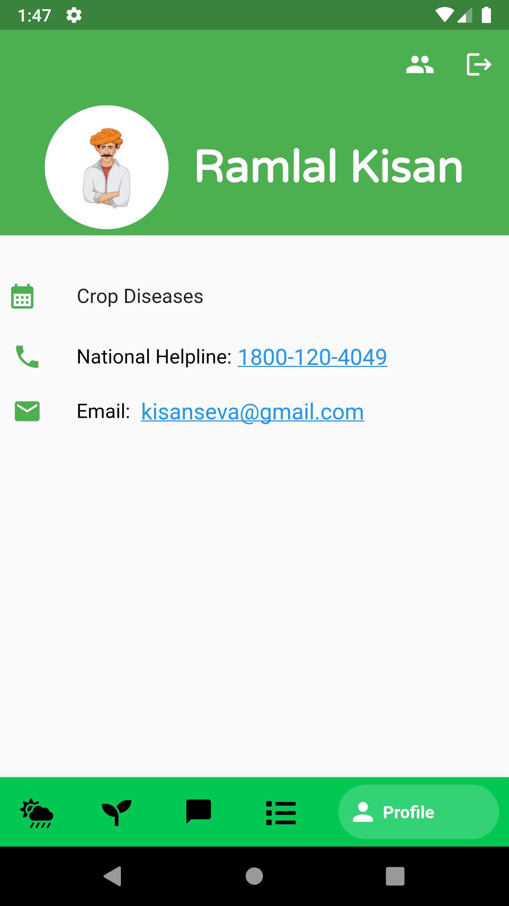
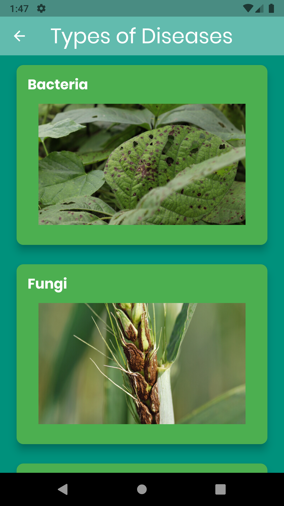

# FarmEasy

FarmEasy is an app-based platform which promotes Smart Agriculture among Indian Farmers. It
is a self-contained digital environment for Farmers to learn more about Farming, cultivate their
crops in a better manner,

# Tech Stack

FrontEnd: Flutter  
Backend: Firebase for Authentication and Database, OpenWeather API for Weather Data   

 
<table style="border:1px solid;">
  <tr >
    <th style="text-align: center; border:1px solid;">Login Page</th>
    <th style="text-align: center; border:1px solid;">Weather Page</th>
    <th style="text-align: center; border:1px solid;">Soil Types</th>
  </tr>
  <tr >
    <td style="text-align: center; border:1px solid;padding:1em;">
        
    </td>
    <td style="text-align: center; border:1px solid;padding:1em;">
         
    </td>
    <td style="text-align: center; border:1px solid;padding:1em;">
         
    </td>
  </tr>
  
</table>
 
<table style="border:1px solid;">
  <tr >
    <th style="text-align: center; border:1px solid;">Soil Detail Page</th>
    <th style="text-align: center; border:1px solid;">Chat Page</th>
    <th style="text-align: center; border:1px solid;">Chat Result Page</th>
  </tr>
  <tr >
    <td style="text-align: center; border:1px solid;padding:1em;">
        
    </td>
    <td style="text-align: center; border:1px solid;padding:1em;">
         
    </td>
    <td style="text-align: center; border:1px solid;padding:1em;">
         
    </td>
  </tr>
  
</table>
 
<table style="border:1px solid;">
  <tr >
    <th style="text-align: center; border:1px solid;">Tips</th>
    <th style="text-align: center; border:1px solid;">Profile Page</th>
    <th style="text-align: center; border:1px solid;">Crop Diseases </th>
  </tr>
  <tr >
    <td style="text-align: center; border:1px solid;padding:1em;">
        
    </td>
    <td style="text-align: center; border:1px solid;padding:1em;">
         
    </td>
    <td style="text-align: center; border:1px solid;padding:1em;">
         
    </td>
  </tr>
  
</table>

